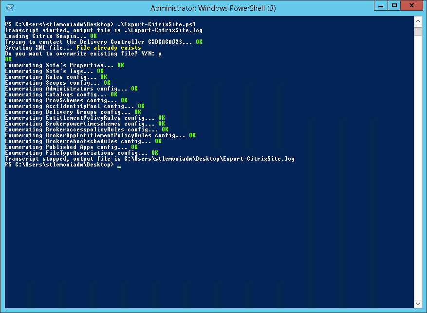
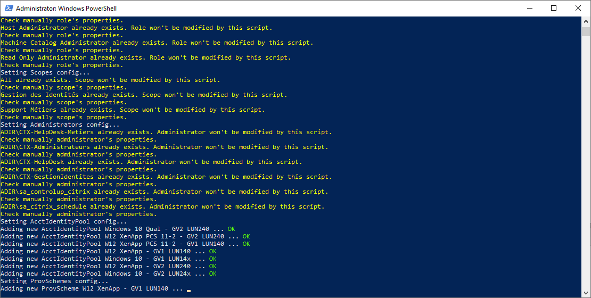

**Disclaimer:** *as always, you should not run any script from someone you don't know in your production environment, especially if you're not able to understand every single line of code you execute. Run it in a safe (e.g. dev) environment first, run your tests and if it sounds ok, run another bunch of tests.*

Recently, I had to update a Citrix Site from 7.15 to 1912 with a lot of catalogs, desktop groups and more than a hundred published apps (along with file type associations and so on). If the update path is well-known among Citrix experts, you are never 100% sure it will run smoothly. And when things start to break, Murphy's law is always waiting for you around the corner. You will have a hard time. Going back will be a hell of a pain, and if you, your coworkers or your boss (or your boss's boss) cannot manage this kind of pressure, then, this is the end of the world and no one will be able to do his job properly.

And maybe, even if all of you manage the stress correctly, it will be the database backup plan that did not work this time only, or someone missed doing a snapshot before running the upgrade, or, or, or. You know what I mean and this is a path I did not want to explore for a "major" upgrade.

Therefore, I decided to start with an entirely new Citrix Site, on fresher Windows Server OS and recreate everything on this new one. Bonus, I will be able to remove any typo errors from the previous configuration (the ones the users cannot see but your eyes are bleeding from every single time you run a PowerShell script).
And if things would have gone bad when I went in production, I would just have to put back the old 7.15 site in production in a couple of clicks.

For the sake of my mind, I chose this path. Well, to be fair, we chose this path with my pair.

First, as Citrix has a great tool to export your configuration to import it in Citrix Cloud, [Citrix Automated Configuration Tool](https://docs.citrix.com/en-us/tech-zone/learn/poc-guides/citrix-automated-configuration.html), I gave it a try and was ready to write the on-prem import script on my own (Citrix does not provide any tool to re-import the configuration on-prem, it's only possible to import in the Cloud, thank you for that). I downloaded the tool, installed it, ran it and... got an error and then a frozen console. In a second.

The moment right after, my brain said "fuck off", "I'll do my own anyway". 

I could have spent time fixing this issue. And could have found another one and another one. And in the end, ended up with an export configuration file I would have to understand, with the usual Citrix black magic in it, before starting to think about my import script.

I'd rather write my own, exporting to an XML file, and then read this file to import the settings into the new site.

So, I started from there.

If you follow me on [Twitter](https://twitter.com/StevenLemonier/) or [LinkedIn](https://www.linkedin.com/in/stevenlemonier/), I shared a post more than 6 months ealier about it.



Yeah, more than 6 months ago. It didn't take me that long to be ready with my script. It was the time needed to be allowed to go in production for 1912 and to check the script did not miss anything (spoiler alert, it did not, we are in prod since last month, I did not change any line of my 6-months old script).

Sorry for the delay guys, it was a hell of a tease right? Back to the story.

Exporting/Importing the site's property, tags, administrators along with associated scopes and roles, were easy.

Then, I started to export catalogs. For non-provisioned catalogs, it's pretty simple. A couple of settings and you're ready. For provisioned ones, you need more. Provisioning Schemes, to target the proper hosting platform and snapshot as well as Identity Pool to create accounts in Active Directory based on a specific naming convention. This was not the most difficult part. No.

Delivery Groups (which is called DesktopGroup by Citrix in PowerShell to ease everything) gave me a harder time because it involves so many things: entitlement policy rules, power time schemes, access policy rules, app entitlement policy rules and reboot schedules among other things. And when you use New-BrokerDesktopGroup, none of this is mentioned. Not even in the Citrix SDK, [as I told you in this article about Citrix catalogs](https://stevenlemonier.fr/how-to-create-an-mcs-catalog-in-powershell/).

It was a back and forth between export and import (with a cleaning of the new site between each try) to figure it out and finally got my delivery groups created the same way it existed on my current site.

After that, published applications were a breeze.

Now, let's talk about the magic. 

The first script, Export-CitrixSite.ps1 will basically read the configuration and write it down in an XML file. **Policies and hosting configurations are not included in this release.**

If you have published applications, it will export icons in a "./resources" directory, with each file matching the IconID associated with your app.

It's 700+ lines long so...

[Here is the export script.](https://github.com/SLemonier/Citrix-Site-Import-Export/blob/main/Export-CitrixSite.ps1)

Calling it is quite simple:

```PowerShell
.\Export-CitrixSite.ps1
```

And the output looks like this:



Before running the import script, I have to warn you. **The Hosting part should already be set and resources (like hosting name connection, storage, network and so on) have to match or be updated in the export.xml file.** 

Otherwise, provisioned catalogs creation will fail.

This is the only prerequisite. Everything else will be configured (except policies, as mentioned).

Once you're ready, you can run the import into your new site. Or in your newly create dev environment, it's another use case!

[Here is the Import script.](https://github.com/SLemonier/Citrix-Site-Import-Export/blob/main/Import-CitrixSite.ps1)

Calling it requires one mandatory parameter but if you have published applications to import, you should include the directory containing the icons. It was my case, so the call was:

```PowerShell
.\Import-CitrixSite.ps1 -XMLFile "./export.xml" -resourcesfolder "./resources"
```

This script will take some time to run, especially on the ProvScheme(s) as it will copy the base image disk to all the datastores set in your resource's storage. Monitor the progression on your hosting platform if you need but the script should not freeze (even if it looks like it had) and keep creating other stuff.
The output looks like this:



As you can see in this example, if a resource already exists (an administrator, a tag, a catalog, a delivery group, a published application), the script won't modify it and will continue the execution.

Also, it won't create any virtual machines. It's up to you to create machines in your catalog(s) and to check the name are available in your Active Directory. Remember, the counts are reset and it will start to name new machines from 0 (or A, does anyone name his machine by ending with a letter?).

Should I modify the script to take this counter as well in my export/import scripts? Let me know in the comments or Twitter/LinkedIn/Github.

Then, assign the machines to your delivery groups. 

And voilà!

I tested it on LTSR versions of Citrix but it *should* work on CR as well.

Also, I did not validate it with PVS catalogs. Only MCS ones.

I hope it will help you as it helped me (and will help for the upcoming "major" upgrade and dev environment creation). Feel free to share any improvements you have, bugs you could encounter, I'll be glad to work with you to tackle these and deliver another version of these scripts.