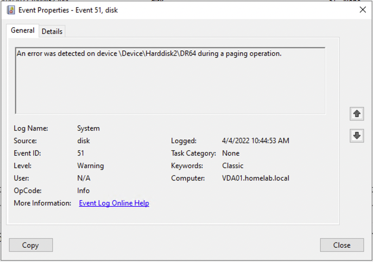
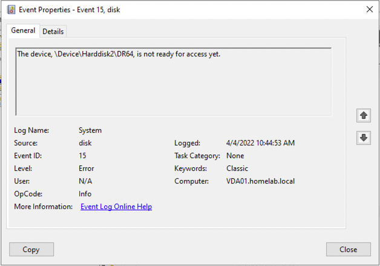
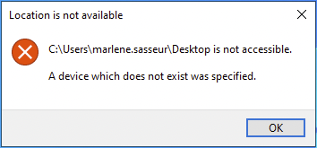

Recently, we had an issue with users complaining about applications crashing in their session. Mainly, it was about the web browser we updated a couple of days earlier, along with a VDA upgrade, and, at first, everyone was pointing it our direction.

You know it better than I:

> It's always Citrix fault.

But looking in Windows events, something strange came up.

The log was full of events ID 51 as below, talking about the disk issue.



Along with Events ID 51, there were a few events ID 15, still talking about disks.



When we checked in the Device Manager and the Disk Managers, there was no reference to the ID pointed in the event error.

In the meantime, we started having the following errors:




Definitely, it was not Citrix. It was related to FSlogix as the user profile (including the Desktop folder) is stored in a VHDX file. Another look in the Disk Manager confirmed what we thought: the profile disk was no longer attached to the virtual machine.

From there, we checked FSLogix logs and found this, looping consistently (I reproduced the issue in my lab):

```Code
[10:53:10.932][tid:00000ee4.00000ee8][INFO]           ===== Begin Session: Volume re-attach
[10:53:10.932][tid:00000ee4.00000ee8][INFO]            Session configuration read (DWORD): SOFTWARE\FSLogix\Profiles\Sessions\S-1-5-21-2433326362-2971583358-1492716030-1109\LogonStage = '5'(Logon_Complete)
[10:53:10.932][tid:00000ee4.00000ee8][INFO]            Attempting re-attach of volume: \\?\Volume{de599a7c-356f-4293-acfb-18e8da96d612}\ for SID: S-1-5-21-2433326362-2971583358-1492716030-1109
[10:53:10.932][tid:00000ee4.00000ee8][INFO]            Configuration setting not found: SOFTWARE\FSLogix\Profiles\LogonSyncMutexTimeout.  Using default: 60000
[10:53:10.932][tid:00000ee4.00000ee8][INFO]            Acquired reattach virtual disk lock for user marlene.sasseur (SID=S-1-5-21-2433326362-2971583358-1492716030-1109) (Elapsed time: 0)
[10:53:10.932][tid:00000ee4.00000ee8][WARN: 00000002]  Error querying VHDReAttachFilePath (The system cannot find the file specified.)
[10:53:10.932][tid:00000ee4.00000ee8][INFO]            VHDPath: \\FS01.homelab.local\Profiles\S-1-5-21-2433326362-2971583358-1492716030-1109_marlene.sasseur\marlene.sasseur.VHDX
[10:53:10.932][tid:00000ee4.00000ee8][INFO]            Username: marlene.sasseur
[10:53:10.932][tid:00000ee4.00000ee8][INFO]            Attempting re-attach as the user
[10:53:10.932][tid:00000ee4.00000ee8][INFO]            Retry Count: 60  Retry Interval (seconds): 10
[10:53:10.979][tid:00000ee4.00000ee8][INFO]            Successfully opened VHD file
[10:53:11.120][tid:00000ee4.00000ee8][INFO]            VHD(x) GetVirtualDiskPhysicalPath request returning after 0 milliseconds
[10:53:11.120][tid:00000ee4.00000ee8][INFO]            VHD(x) FindFirstVolume request returning after 0 milliseconds
[10:53:12.030][tid:00000ee4.00000ee8][INFO]            VHD(x) loop through volumes returning after 907 milliseconds, volumes tested: 4
[10:53:12.030][tid:00000ee4.00000ee8][INFO]            VHD(x) getVolumeGUIDFromPhysicalPath request returning after 907 milliseconds
[10:53:12.030][tid:00000ee4.00000ee8][INFO]            VHD(x) volume online request returning after 0 milliseconds
[10:53:12.030][tid:00000ee4.00000ee8][INFO]            VHD(x) waitForVolumeMount request returning after 1016 milliseconds
[10:53:12.030][tid:00000ee4.00000ee8][INFO]            Volume successfully re-attached for \\FS01.homelab.local\Profiles\S-1-5-21-2433326362-2971583358-1492716030-1109_marlene.sasseur\marlene.sasseur.VHDX
[10:53:12.077][tid:00000ee4.00000ee8][INFO]            Session configuration read (DWORD): SOFTWARE\FSLogix\Profiles\Sessions\S-1-5-21-2433326362-2971583358-1492716030-500\LogonStage = '5'(Logon_Complete)
[10:53:12.077][tid:00000ee4.00000ee8][INFO]           ===== End Session: Volume re-attach
[10:53:12.077][tid:00000ee4.00000ee8][INFO]           Volume attach event
[10:53:12.109][tid:00000ee4.00000ee8][INFO]           Configuration setting not found: SOFTWARE\FSLogix\Profiles\ReAttachRetryCount.  Using default: 60
[10:53:12.109][tid:00000ee4.00000ee8][INFO]           Configuration setting not found: SOFTWARE\FSLogix\Profiles\ReAttachIntervalSeconds.  Using default: 10
```

The error *"Error querying VHDReAttachFilePath (The system cannot find the file specified.)"* is cristal clear, something went wrong with the storage where the file is stored. It was not related to the user's rights as it was able to open the VHDX file.

A look on the storage side and we got the root cause: **Storage was full**. 

It was easy to solve: just add more storage.

*(A couple of days later, something similar happened, same applications crashing. This time, the link to the storage was lost due to scheduled maintenance, the failover killing the opened sessions).*

But I know.

Why the hell our storage was not monitored?

Actually, it was. But as you know with the cloud, nothing is simple.

So, how can we improve the monitoring to, at least, be aware of such failure and be proactive instead of waiting for the tsunami of incidents overwhelming support teams and maybe yourselves?

I'd say, ensure your monitoring is working properly and don't wait for it to get down to ensure it is configured as expected: **do some Chaos Engineering**! 

> Am I spoiling about something here? Yes, I am!

But in the meantime, here is what I did.

I know in big companies, responsibilities and teams are segregated, and you cannot have hands-on what other people do or can do.

Thus, if you cannot ensure the storage team is not able to do it efficiently (and maybe it's not on them but on the tools or the solution they are told to use that have some limitations, as it was in our case), you have to do something on your side. To be proactive. In case of a failure, every minute counts. And it's your job to provide the best service you can, so, if we can do something more, we must do something more.

In our situation, we decided to monitor the event ID 15 on all our VDA servers and create an alert when such an event appears. This way, we would talk directly to the storage team before the storm would come.

But, hey, let's hope this won't happen again.